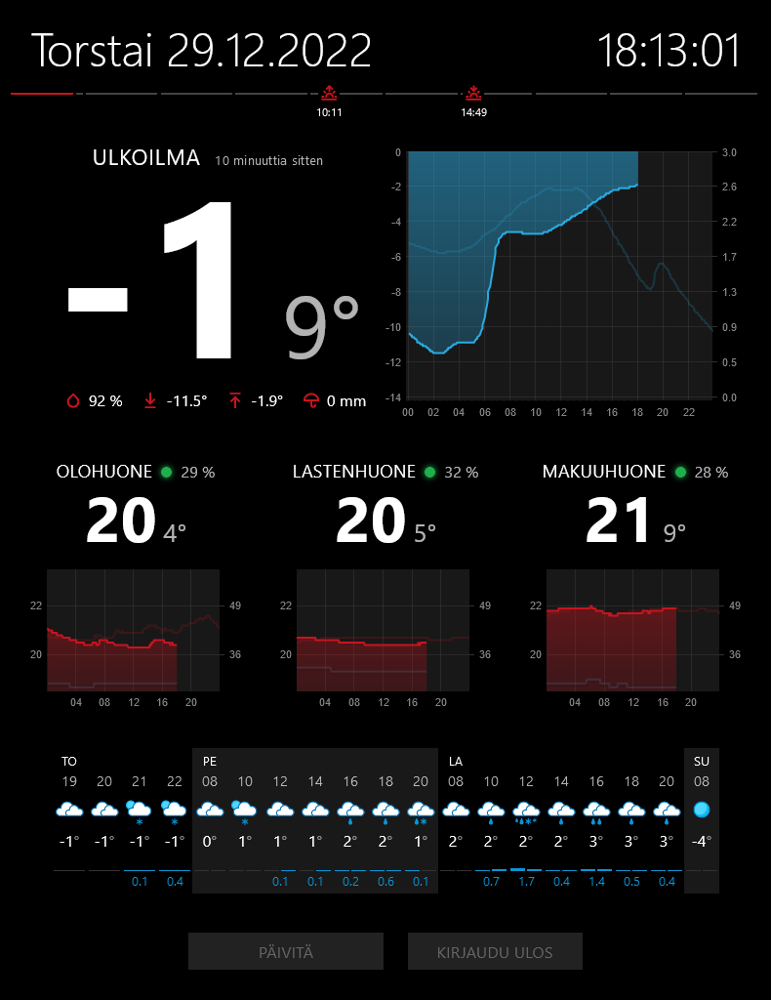

# Netatmo Weather Display

A weather display web application for presenting temperature information gathered by locally installed [Netatmo weather sensors](https://www.netatmo.com/en-eu/weather/weatherstation).

Optimized for 1<sup>st</sup> generation iPad. Using Chrome browser on iPad allows us to "hide" the browser chrome by tapping on the date. 

## Screenshot



## Requirements

1. [Netatmo weather station](https://www.netatmo.com/en-eu/weather/weatherstation) — you will need the [MAC address of the big module](https://helpcenter.netatmo.com/en-us/smart-home-weather-station-and-accessories/product-interactions/how-do-i-find-my-products-serial-number-or-its-mac-address). My setup consists of big module and three additional modules, thus the app is optimized for the amount.
1. [Netatmo connect dev app](https://dev.netatmo.com/apps/createanapp) created (this is needed to authorize fetching the data via Netatmo API) — you will need to make note of the `client ID` and `client secret` under _App Technical Parameters_.
1. Your latitude and longitude for weather forecast by Finnish Meteorological Institute and for sunrise/sunset times — get these by opening [Google Maps](https://www.google.com/maps) on desktop and right-clicking on the map; you can see the coordinates on the top of the popup. 
1. Web server with PHP support (local is fine).

## Installation

1. Clone the repository to web server.
1. Rename `config.example.php` to `config.php` and adjust the definitions inside it.
1. Open the site on the server.

## Local development

When developing and testing locally, you may bump into an error message saying `SSL certificate problem: self signed certificate`. In this case, you should download the [cacert.pem certificate bundle](https://curl.se/ca/cacert.pem) and define the location of this file in `php.ini` directive like so:
```
curl.cainfo = "c:\example_folder\cacert.pem"
``` 
If you're using Local by Flywheel on Windows, the correct file is `php.ini.hbs` and can fe found under `Local Sites\<sitename>\conf\php-x.y.z` where `x.y.z` is the PHP version currently utilized by the site. Add the line, restart the site.  

## Credits

Weather forecast from [Norwegian Meteorological Institute's developer API](https://developer.yr.no/doc/GettingStarted/).

Icons from [Feather Icons](https://feathericons.com/). Weather symbols from [Finnish Meteorological Institute](https://www.ilmatieteenlaitos.fi/saamerkkien-selitykset).
