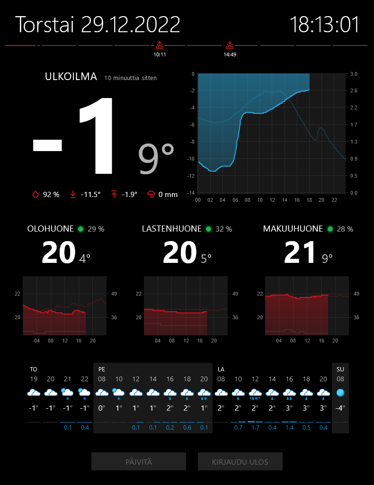

# Netatmo Weather Display

A weather display web application for presenting temperature information gathered by locally installed [Netatmo weather sensors](https://www.netatmo.com/en-eu/weather/weatherstation).


## Screenshot



## Requirements

1. [Netatmo weather station](https://www.netatmo.com/en-eu/weather/weatherstation) — you will need the [MAC address of the big module](https://helpcenter.netatmo.com/en-us/smart-home-weather-station-and-accessories/product-interactions/how-do-i-find-my-products-serial-number-or-its-mac-address). My setup consists of big module and three additional modules, thus the app is optimized for the amount.
1. [Netatmo connect dev app](https://dev.netatmo.com/apps/createanapp) created (this is needed to authorize fetching the data via Netatmo API) — you will need to make note of the `client ID` and `client secret` under _App Technical Parameters_.
1. Your latitude and longitude for weather forecast by Finnish Meteorological Institute and for sunrise/sunset times — get these by opening [Google Maps](https://www.google.com/maps) on desktop and right-clicking on the map; you can see the coordinates on the top of the popup. 
1. [Node.js](https://nodejs.org/) and npm.

## Installation

1. Clone the repository.
1. Run `npm install` in the project root.
1. Copy `.env.example` to `.env` and fill in the required values.
1. Install backend dependencies with `cd backend && npm install`.
1. Install frontend dependencies with `cd frontend && npm install`.

## Local development

1. Start the backend API with `cd backend && npm run dev`.
1. Start the frontend app in another terminal with `cd frontend && npm run dev`.
1. Open the frontend URL shown by Vite (usually `http://localhost:5173`).

## Production builds

1. Build backend with `cd backend && npm run build`.
1. Build frontend with `cd frontend && npm run build`.

## Simplest production deployment (one command)

This project now supports a single command deployment flow that:

1. Installs root, backend and frontend dependencies.
1. Builds SVG assets, frontend and backend.
1. Starts the backend server, which also serves the built frontend.

Run this from the repository root:

```bash
npm run deploy
```

### Required backend environment variables for production

Set these in `backend/.env` on your server:

```env
NODE_ENV=production
PORT=3001
FRONTEND_ORIGIN=https://your-domain.com
SESSION_SECRET=your-long-random-secret
NETATMO_CLIENT_ID=...
NETATMO_CLIENT_SECRET=...
NETATMO_REDIRECT_URI=https://your-domain.com/auth/callback
HISTORY_TIMEZONE=Europe/Helsinki
# Optional forecast location override (otherwise first Netatmo station location is used)
# FORECAST_LAT=60.192059
# FORECAST_LON=24.945831
# FORECAST_ALTITUDE=30
```

### Notes

- Keep your process running with a process manager like PM2 or systemd.
- You can place Nginx in front for TLS and domain routing, but the app works with one Node process out of the box.

## Opalstack one-command updates

If your repository lives inside Opalstack app folder layout such as:

- `~/apps/netatmo/myproject` (this repository)
- `~/apps/netatmo/start` and `~/apps/netatmo/stop` (generated by Opalstack)

you can deploy updates with a single command:

```bash
cd ~/apps/netatmo/myproject
bash deploy.sh
```

The script will:

1. Pull latest Git changes with fast-forward only.
1. Install root, backend and frontend dependencies.
1. Build SVG assets, frontend and backend.
1. Restart via Opalstack `stop` and `start` scripts when available.

If needed, override the detected app root:

```bash
APP_ROOT=~/apps/netatmo bash deploy.sh
```

## Credits

Weather forecast from [Norwegian Meteorological Institute's developer API](https://developer.yr.no/doc/GettingStarted/).

Icons from [Feather Icons](https://feathericons.com/). Weather symbols from [Yr](https://nrkno.github.io/yr-weather-symbols/).
